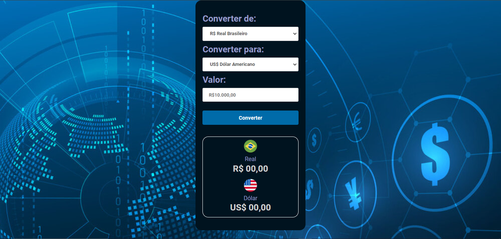

<h1>Conversor de moedas em JavaScript</h1>
Esse foi o primeiro projeto que aprendi no DevClub usando JavaScript.
Este projeto é um conversor de moedas que permite converter valores de Real para Dólar Americano, Euro, Libra e Peso Argentino. Ele é importante porque fornece uma ferramenta útil para pessoas que precisam converter moedas com frequência.

>Convert Money: https://daliosy.github.io/convert-money/

<h2>Habilidades recentes:</h2>

Aprendi querySelector, function, if, innerHTML, addEventListene e NumberFormat no JavaScript.

<h2>Contato:</h2>

> Linkedin: https://www.linkedin.com/in/dalio-s-yamada/

> Github: https://github.com/DalioSY/convert-money

#HTML #CSS #JavaScript #Programação  #Dev #Desenvolvedor-Web #DesenvolvedorFrontEnd #DesenvolvedorFullStack #TransiçãoDeCarreira #Oportunidades #DisponívelParaTrabalho

